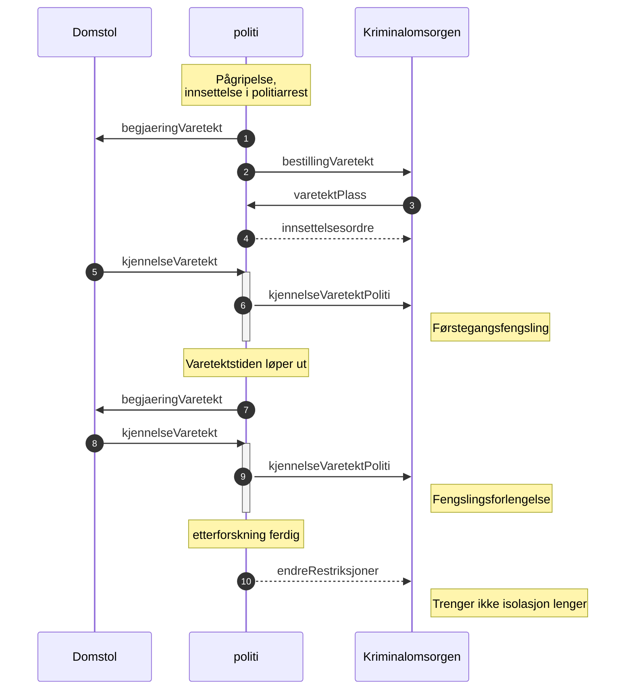

# esas-genererte-kontrakter

Genererer kotlin-klasser basert på schema.json schema kontrakter. Brukes til elektronisk samhandling mellom politiet,
kriminalomsorgen og domstolene

# Kontrakter

Forklaring på kontrakter og meldinger som er definert i dette prosjektet.

## [DA](kontrakter/da)

### [Varetekt](kontrakter/da/varetekt)

### [Felles](kontrakter/da/felles)

## [Felles](kontrakter/felles)

### [Kodeverk](kontrakter/felles/kodeverk)

Kodeverk verdier som vi deler skal følge JSON Schema definert her.
Kodeverksfilene skal ligge på underkataloger her: [Kodeverk](kodeverk)

### [Kvittering](kontrakter/felles/kvittering)

Kvitterings-meldingen er tenkt brukt som en tilbakemelding på status for en gitt melding fra mottaker til avsender.

Hver kvitteringsmelding skal som minimum inkludere en egen _meldingsid_, en _referanseid_ til meldingen den svarer til,
pluss en status på den refererte meldingen.

Dersom noe er feil på referansemeldingen skal kvitteringsmeldingen indikere om feilen ligger på avsenders eller
mottakers side, og indikere om det er en teknisk feil eller mangler dersom feilen er på avsendersiden.
En kvitteringsmelding som indikerer feil bør også inneholde en beskrivelse om hva som har feilet.

#### Prinsipper

* Status **UNDER_MOTTAK** indikerer at meldingen er mottatt, men ikke ferdig prosessert inn i saksbehandlingssystemet.
  Det kan fremdeles oppstå feil som gjør at avsender eller mottaker må starte feilsøking.
* Status **MOTTATT** indikerer at alt er ok.
    * Avsender kan fjerne vedlegg fra filtjeneste når MOTTATT status er mottatt
    * Ingen nye kvitteringer forventes.
* Status **FEILET_AVSENDER_TEKNISK** indikerer at det er en teknisk feil hos avsender. F.eks. feil format, vedlegg som
  ikke fins på STFP selv om det fins referanse i melding etc. Det er forventet av _avsender_ iverksette nødvendige
  tiltak for å sende melding på nytt.
    * Feltet 'beskrivelse' skal fylles ut med en feilmelding/exception
    * En slik status skal aldri sendes etter at en MOTTATT melding er sendt
    * Ingen nye kvitteringer forventes.
* Status **FEILET_AVSENDER_MANGLER** indikerer at det er mangler i forsendelsen som er avdekket av saksbehandler. F.eks.
  at forventet påtegning er avglemt. Meldingen forkastes og det er forventet av _avsender_ skal sende hele meldingen på
  nytt - vanligvis et menneske.
    * Feltet 'beskrivelse' skal fylles ut med en feilmelding skrevet av bruker
    * En slik status skal aldri sendes etter at en MOTTATT melding er sendt
    * Ingen nye kvitteringer forventes.
* Status **FEILET_MOTTAKER** indikerer at det er noe feil hos mottaker. F.eks. bug eller system nede. Det er forventet
  at _mottaker_ undersøker.
    * En slik status skal aldri sendes etter at en MOTTATT melding er sendt
    * Det forventes at det skal komme en MOTTATT, FEILET_AVSENDER_MANGLER eller FEILET_AVSENDER_TEKNISK kvittering i
      etterkant dersom feilen utbedres på mottakersiden. Men statusen kan bli stående dersom problemet løses ved at
      meldingen sendes på nytt

## [Konfliktrådet](kontrakter/konfliktraadet)

### [Oppdatert saksstatus](kontrakter/konfliktraadet/oppdatertsaksstatus)

Når en sak behandles hos konfliktrådet er det noen nøkkelstatuser som påtale hos politiet har behov for,
slik at de kjenner sakens status.

## [Kriminalomsorg](kontrakter/kriminalomsorg)

### [Aksept tilbudt varetektsplass](kontrakter/kriminalomsorg/akseptTilbudtVaretektsplass)

## [Avvising tilbudt varetektsplass](kontrakter/kriminalomsorg/avvisningTilbudtVaretektsplass)

Det ligger implisitt at en tilbudt plass ikke reserveres til "evig tid", men fristilles etter f.eks. 24 timer om den
ikke askepteres.
(En mer konkret utløpsfrist kan måtte spesifiseres hvis nødvendig)

## [Tilbud varetektsplass](kontrakter/kriminalomsorg/tilbudVaretektsplass)

## [Personundersøkelse](kontrakter/personundersoekelse)

#### Overordnet beskrivelse av domenet:

Kilde: https://www.kriminalomsorgen.no/personundersoekelse.535031.no.html

"Ei personundersøking er ei kartlegging av ein sikta eller tiltalt person etter oppdrag frå påtalemakt eller domstol.

Kartlegginga av dei personlege livsforholda og framtidsutsiktene til den sikta skal bidra til at domstolen får eit betre
grunnlag til å fastsetje ein riktig straffereaksjon.

Ein sikta person kan også sjølv, anten direkte til påtalemakt eller via advokat, be om at det blir henta inn
personundersøking i samband med straffesaka.

Personundersøking blir utført av friomsorgskontora i kriminalomsorga og skjer i form av eit intervju med sikta og
eventuell innhenting av informasjon frå andre kjelder, eksempelvis fastlege, NAV eller arbeidsgjevar (etter samtykke frå
den sikta)."

### [Rekvisisjon personundersøkelse](kontrakter/personundersoekelse/rekvisisjonPersonundersoekelse)

#### Utestående avklaringer

Kontaktpersonen må oppgis for videre dialog.
Er påtalejurist alltid kontaktpersonen i politiet for disse sakene, eller kan det være etterforskere m.v.?
KO må uansett vite hvem som skal ha personundersøkelsen i retur. Vi må derfor enten ha et separat, nytt påkrevd felt for
kontaktperson - eller gjøre jurist påbudt.

Straffeprosesslov-referanse, skylderkjennelse og siktet/vergeorientering samt samtykke er ikke satt som nødvendige så
langt. De er imidleritd en del av ny PUM-mal, og det kan være vi skal ta en dobbeltsjekk på disse. Enn så lenge oppleves
at skylderkjennelse kan trekkes tilbake eller være misforstått, samt at KO har praksis på å innhente samtykke i mange
tilfeller alt (men mulig noen effektivisering er mulig med Politiets nye samtykkeløsning om dette er egnet?)

Er det nødvendig med Varetekt-markering for "hastesak" (ref. PUM mal) ? Eller holder det med ønsket fristdato?
Friomsorgskontoret vet ikke nødvendigvis om en person er i varetekt eller ei.

KO venter personundersøker kan måtte møte i hovedforhandling - vi tror ikke det er nødvendig å ha dette som et
strukturert felt, men la oss dobbeltsjekke.

#### Avklarte avklaringer

Den siktede må identifiseres sikkert (fnr/D-nr) og ha bosted eller oppholdsadresse angitt.
Kriminalomsorgen bruker oppholdsadresse og bostedsadresse til å rute rekvireringen til rett ansvarlig friomsorgskontor.
Sikker identitet er nødvendig for å hente korrekte og sensitive personopplysninger fra kildene.

Evt. verger bør identifiseres med fødselsnummer for informasjonssikkerheten. Dette gir en robusthet i tilfelle
adressebytter, flere personer med like/liknende navn, etc.

KO forventer straffeattest og siktelsealltid legges ved (PDF).
Rettsbok fra tingrett (dom fra lavere intans) legges ved (PDF) for en evt. PeU i en sak som går for 2.instans.

Merk at man kan rekvirere en PUM selv om siktede ikke er mindreårig per i dag. Det er alderen på gjerningstidspunktet
som avgjør.

#### Behov som vi har avklart kan vente

Formålet med undersøkelse, vurdering av hensiktsmessighet av fengsling etc. kan være utstrukturert i PDF i denne omgang.

KOG-delen kan også tas som fritekst - konfliktrådet ville potensielt ha nytte av en strukturering av dette, men de får
ikke denne meldingen direkte i denne omgang. Potensielt forbedring i senere versjon.

#### Ønsker / mangler

Synk av adressemodell og adressetyper mot folkeregisterets modell her - og generelt?

Tolkespråk er ønsket, men ikke et absolutt krav. Modellen støtter p.t. støtte "statsborgerskap" som dekker deler av
behovet. Men klarer vi noe mer her, er det ønskelig, siden det åpenbart er distinksjoner her.

Enkelte enheter kan ønske "gjenbruke" samme tolk som påtale har benyttet, mens andre enheter har egne avtaler med andre
tilbydere av tolketjenester. Det ansees derfor ikke som kritisk å oppgi kontaktinfo på tolk.

### [Retur personundersøkelse](kontrakter/personundersoekelse/returPersonundersoekelse)

#### Avklaringer

Retur / svar på en rekvisisjon.
Inneholder i første versjon metadata for å rute meldingen hos rekvirent (saksreferanse+rekvisisjonsID) samt selve
rapporten som vedlegg.  
Meldingen brukes også om siktede ikke ønsket møte eller at undersøkelse ikke kunne gjennomføres av annen årsak - da vil
dette fremgå av vedlegget.

## [Politi](kontrakter/politi)

### [Bestill transport](kontrakter/politi/bestilltransport)

#### Bestilling av transport

Skjemaet skal p.t. IKKE brukes til generelle transportbestillinger, kun transport ifm *vareteksinnsettelsen*
Bruksområde kan antagelig utvides i fremtiden, men det må koordineres videre mellom KO og PIT

#### Status

1. versjon merge til main for å kunne omstrukturere. PR og Branch er slettet. Jobber med i detalj når denne blir aktuell
   og implementere.

#### Avklaringer

Er det nyttig å oppgi transportlokasjoner med GPS-koordnater el.l.? Dagens papirskjema er bare 1 linje fritekst per
adresse. Mulig det er "godt nok" i første omgang.

Vi etablerer sentralt mottak til Kriminalomsorgen.
Har KTT behov for mer struktur for å forfine ruting-regler, eller er manuell ruting fra "
8301transport@kriminalomsorg.no" fortsatt godt nok?
PeU note (kun indirekte relevant her): Ruting internt i KO avhenger bl.a. av bosted. Trengs "pågrepetkommune" bedre
strukturert for odde cases - hjemløse etc?

Kan noe informasjon fjernes på sikt? Mottaker er separat (KTT) fra mottaker av bestilling av varetektsplass, så med
tanke på å få en første løsning raskt i prod er det en fordel å duplisere en del informasjon her. Antagelig er dette
enklere å lage i "BL next" også da vi antagelig kan gjenbruke mer kode framfor skreddersøm.

typeFremstiling:
Vi har lagt på en type for videre/returtransport etter en fremstilling.
Uavklart om dette skjer ved varetektsinnsettelser (man "vet" ikke om dommer etterkommer politiets begjæring, så det er
ikke alle tilfeller der siktede skal til varetekt i etterkant - men mulig man har en i praksis på å bestille+avbestille
transport i de tilfellene? Må avklares

kontaktinformasjon (avsender):
KTT trenger telefonnummer til bestiller. (Dette er påbudt i dagens skjema.)

### [Bestill varetektsplass](kontrakter/politi/bestillVaretektsplass)

#### Status

Venter på avklaring fra styringsgrupp/Justisdepartementet, avslutter alle PR for å kunne omorganisere.

#### Pågrepet kommune

Pågrepet kommune brukes til NAV av Kriminalomsorgen fordi det er det lokale NAV kontoret i pågrepet kommune som har
ansvaret ?

#### Avklaringer

Hvordan skal det virke med sentralt til Kriminalomsorgen og direkte til et fengsel?
Vanligvis sendes det til KDI sentralt og bruker hos politiet blir ikke bedt om å velge fengsel. Det er mulig å velge
fengsel direkte, det kan være en advarsel.

Schema vil i alle fall innehold bare en mottakerOrganisasjon som er enten KDI eller et fengsel, KDI kan implementere at
det rutes til sentralt mottak hvis det er feil at det skal rett til fengsel.

Kan vi ha med det som tekst på kvittering ?

### [Endre Restriksjoner](kontrakter/politi/endrerestriksjoner)

Denne meldingen sammen med [Kjennelse varetekt politi](kontrakter/politi/kjennelsevaretektpoliti) erstatter
oppdaterVaretekt (slettet)  
Hvis påtale bestemmer seg for å lette på restriksjoner/isolasjon så skal denne meldingen brukes.

**OBS** denne meldingen har prioritet 3 hos politiet og det betyr vi vet ikke vet når den vil bli implementert.

### [Felles](kontrakter/politi/felles)

#### Felles definisjoner til dokumentasjon

Vi har ikke felles skjema da allt er inkludert i hver melding, men samler noen definisjoner her for diskusjon.
person

#### Fortrolige adresser

Ved fortrolige adresser så blir det aldri sendt med noen adresser fra BL.
Den er satt til tom for å unngå lekasjer av fortrolige adresser.
(person-fortrolig-adresse.json).

#### Strengt fortrolige adresser

Personen blir markert så vi vet at han/hun har en strengt fortrolig adresse.
Adressen er ikke hemmelig i seg selv da det er en postboks adresse.
hmmm. vi kan dele den adressen, men det må tas hensy (hvilke hensyn ?).
(person-strengtfortrolig-adresse.json)

#### Klient adresse

Kommer, vi har ikke håndtering av denne foreløpig.
Regner med at denne kan deles med Domstol, Kriminalomsorgen.
Har laget et forslag der det kanskje blir slikt.
(person-klient-adresse.json)

#### Folkeregister eksempler

Se katalogen [freq-eksempler](kontrakter/politi/felles/freg-eksempler)

### [Innsettelsesordre](kontrakter/politi/innsettelsesordre)

#### Innsettelsesordre

Når siktet blir satt i fengsel hos Kriminalomsorgen (KDI) skal det alltid følge med en innsettelsesordre. Tidligere ble
dette gjort ved at politiet fyllte ut en rødlapp som var et skjema med detaljer om siktede og soning i varetekt.
Innsettelsesordren kan komme før kjennelse når en siktet blir flyttet fra politiarresten til Kriminalomsorgen og etter
kjennelsen. Når innsettelsesordren kommer etter kjennelse så skal kjennelsen følge med.
PIN er politiets innsettelsesordre som er den som kommer før kjennelse fra retten.

Dette er en stor og komplisert melding som vi må sjekke om passer sammen med arbeidsprosessene til poltiet. Tenker
særlig på informasjon om helse og risiko. En bedre løsning er å dele opp med egen informasjon om helse og risiko og
oppdatering når det endres.

1. Innsettelseordre med fokus på juristen sin ordre, kun restriksjoner hvis kjennelse ikke er mottatt.
2. Kjennelse fra domstolene kun egen melding, ikke en del av denne.
3. Risiko og helse informasjon egen melding. Bør også gjelde bestilling av varetektsplass.

#### varetektsyklus

En varetektsyklus er en serie av varetektshendelser fra en person blir pågrepet til han slipper ut av fengsel. F.eks.
følgende hendelser.

1. Besluting om pågripelse
2. Pågripelse
3. Inn i politiarresten
4. Overføre fra politiarresten til kriminalomsorgen.
5. Slipper ut av fengsel ferdig med varetekt.

VaretektSyklusId vil være lik på alle hendelser fra politiet på denne.

#### Avklaringer

Restriksjonstype annet, trenger eksempler fra påtale.

Deling av data, kan vi dele fødselsnummer mm. på vitner og verger. Hva trenger Kriminalomsorgen det til?
Hva med kjønn, er det nødvendig på verger?

Risiko og helseinformasjon ligger med som frivillig element nå, krever mer kartlegging av prosessen hos politiet.
Kanskje denne kommer like i etterkant i egen melding eller kune i bestilling av varetektsplass.

#### Stegvis implementering

Verger
Straffesaker som er de som er med i siktelsen.
Varetektsyklusid - senere

### [Kjennelse varetekt politi](kontrakter/politi/kjennelsevaretektoliti)

#### Kjennelse på varetekt til Kriminalomsorgen (kjennelseVaretektPoliti)

Når politiet mottar kjennelse så blir kjennelsen strukturert og med kjennelse/rettsbok PDF rutet videre til
Kriminalomsorgen.
Det skal legges ved data om straffesakene, se nedenfor.

Denne meldingen skal brukes på førstegangsfengslinger og fengslingsforlengelser og den erstatter oppdaterVaretekt (nå
slettet) sammen med meldingen [Endre restriksjoner](kontrakter/politi/endrerestriksjoner)  
Når politiet mottar en kjennelse på varetekt så blir denne meldingen sendt automatisk til Kriminalomsorgen og den vil
inneholde kjennelsen strukturert og på PDF format fra domstolen samt data fra straffesaken hos politiet.

#### Status - ikke godkjent

Begge parter må være enige om innholdet.

#### Data

#### avsender og domstol

Det er automatisk videresending av kjennelsen fra domstolen fra politiet, avsender vil være eierdistriktet for
straffesaken. Informasjon om domstol, dommmer og saksbehandler kommer sammen med kjennelsen.

#### Forlengelse

Hvis kjennelsen er et svar på en begjæring om varetekt med forlengelse.  
**OBS** til å begynne med så er flagget forelengelse i begjæringen satt av brukerne hvis førstegangsfengslingen er gjort
på gammelmåten via BL.

#### Siktede

Siktede fra domstolen kan være en en annen person en den som finnes på straffesaken, dvs. vi finner ikke match mellom
data fra domstolen og det vi har som straffesaksdata.

* *personVaretektInfo->personVaretekt* er personen fra straffesak hvis vi finner match mellom domstolen sin person og en
  siktet person på straffesaken (fødselsnummer, SSP nummer, D-nummer, etternavn, fornavn), det bør alltid være match.
* Siktede informasjon fra domstolen finnes i kjennelsen   
  *kjennelseVaretekt->personVaretektDomstol*.
* Siktedes informasjon fra straffesaken vil finnes på: *personVaretektInfo->straffesaksInfo->siktet*

#### Straffesaksdata

I første omgang så kommer informasjon kun fra hovedsaken og det kommer ikke med lovbud. Når siktelsen kommer (sammen med
tilståelsessaker) så vil vi kunne sende med informasjon på alle straffesaker som siktede er involvert i.

#### Data om helse, risiko og tilstand

Se [Bestill varetektsplass](#bestill-varetektsplass) for mer informasjon om data om helse, risiko og tilstand.

#### Det legges ikke ved PDF dokumenter fra straffesaken

Dvs. siktelses PDF blir ikke med, se avklaring nedenfor. Kjennelsen fra domstolen på PDF format blir lagt ved
oversendelsen.

#### Flyt

* Kvitteringer skal sendes på alle meldinger og er ikke vist i diagrammet.
* varetektsplass er tilbud på plass i et gitt fengsel,
  se [Bestill varetektsplass](kontrakter/politi/bestillvaretektsplass)
* Innsettelsesordren er vist som et eksempel og vil bli brukt hvis kjennelsen ikke er klar til når personen skal flyttes
  til Kriminalomsorgen.
* [Endre restriksjoner](kontrakter/politi/endrerestriksjoner) så påtale kan lette på restriksjoner. Ikke planlagt når
  denne skal implementeres.

#### Avklaringer

I arbeidet med fengslinger og informasjon mellom politi og Kriminalomsorgen er det gjort noen antagelser i den nye
meldingen for kjennelse fra domstolene.

#### Straffesaksinformasjon (Siktelse) og data til Kriminalomsorgen

Kjennelsen fra domstolen inneholder ikke detaljer om siktelsen til den personen som skal varetektsfengsles og den
strukturerte kjennelsen er heller ikke klar fra politiet.

1. Siktelsesdokumentet (PDF) blir ikke med da det inneholder informasjon om andre og detaljert beskrivelse av hva som
   skjedde.

#### Siktelsesinformasjon til senere

Senere så vil vi ta med siktelsesinformasjon inkludert lovbud på alle straffesaker siktede er siktet for.

1. Grunnlagstekst er en beskrivelse av selve hendelsen, trenger Kriminalomsorgen den?

#### Kjennelse

Det kommer småjusteringer på kjennelsen ennå.

### [Overfør sak konfliktråd](kontrakter/politi/overfoersakkonfliktraad)

Når en sak skal til behandling hos konfliktrådet skal den oversendes dit
med nok informasjon så de klarer å opprette saken elektronisk på sin side.

### [Varetekt](kontrakter/politi/varetekt)

#### Begjæring om varetekt fra politi til tingretten

Denne meldingen brukes av politiet når de skal begjære om varetekt til en tingrett og samme melding brukes til
førstegangsfengsling og forlengelser.
Det legges ved sakstyrende dokumenter som vedlegg til denne meldingen. Restene av dokumentene (politdokumentene) kommer
som en sammenstilling med kobling
til riktig begjæring om varetekt (kravId). Sammenstillingen lages vha. BL Straffesaksforsendelse.

#### Status på data som politiet klarer å fylle ut i dag

* Det er ikke med siktelse.
* Det er ikke med aktor.
* Det er ikke mulig i varetekt å sende begjæring om varetekt med grunn vilkårsbrudd.
* Dokumenter får ikke med dokumentkategori
* Forlengelse har ikke med noen referanse til forrige fengsling.
* berammetFengslingsmoete er ikke implementert

#### Data endringer som ikke er med i JSON Schema

#### Begrenset offentlighet

Ønsker
Kan være Domstolloven 130a eller b eller en kombinasjon.

#### Forlengelser

Forlengelser, med fengslingsfrist med i frivillig kontrakt.

#### Identifikator på profesjonelle personer

Krever større endringer i BL og tilhørende systemer så vi kan ikke gjøre det nå.
Det vil ikke bli prioritert på profesjonelle personer.

# [Kodeverk](kodeverk)

## [Felles](kodeverk/felles)

[Språkkategori](kodeverk/felles/spraakkategori.json) inneholder kategorisering av dokumenter som utveksles mellom
sammarbeidspartene. Denne skal inneholde dokumentkategorier for alle partene.
Dokumenter er som oftest PDF dokumenter med fritekst, men det kan være andre format.

[Dokumentkategori](kodeverk/felles/dokumentkategori.json) inneholder iso-369-3 standardiserte koder over språk. Dette er
metadata i tilfeller hvor det f.eks. er behov for tolk. 

